# Cloud Task Manager — AWS DevOps & CI/CD Project

A production-style DevOps and Cloud deployment project demonstrating how to containerize a Flask application, build an AWS cloud infrastructure, securely deploy through GitHub Actions, and run the application on a private EC2 instance behind an Application Load Balancer.

---

## 📌 Project Overview

**Cloud Task Manager** is a Flask-based web application deployed using AWS and automated through a GitHub Actions CI/CD pipeline.

The primary objective of this project was not to build a complex application or database system, but to demonstrate practical **DevOps and Cloud Engineering skills**.

The application was intentionally kept simple so that the focus remained on:

* Cloud infrastructure
* Networking
* Containerization
* CI/CD
* IAM and security
* Private compute
* AWS Systems Manager
* Container registry
* Load balancing
* Secret management
* Automated deployment
* Troubleshooting and production-style architecture

---

# 🏗️ Architecture

The final architecture followed this model:

```text
                              INTERNET
                                  │
                                  ▼
                    ┌─────────────────────────┐
                    │ Application Load        │
                    │ Balancer                │
                    │                         │
                    │ Public Subnets          │
                    └────────────┬────────────┘
                                 │
                                 │ HTTP :5000
                                 ▼
                    ┌─────────────────────────┐
                    │ Target Group            │
                    │                         │
                    │ EC2 Target              │
                    └────────────┬────────────┘
                                 │
                                 ▼
                    ┌─────────────────────────┐
                    │ Private EC2 Instance    │
                    │                         │
                    │ Docker                  │
                    │ Flask Application       │
                    │ Port 5000               │
                    └────────────┬────────────┘
                                 │
                                 │ Outbound Traffic
                                 ▼
                    ┌─────────────────────────┐
                    │ NAT Gateway             │
                    │ Public Subnet           │
                    └────────────┬────────────┘
                                 │
                                 ▼
                              INTERNET


                    CI/CD DEPLOYMENT FLOW

Developer
    │
    │ git push
    ▼
GitHub Repository
    │
    ▼
GitHub Actions
    │
    ├── Checkout Code
    │
    ├── Authenticate using GitHub OIDC
    │
    ├── Build Docker Image
    │
    ├── Tag Image using Git SHA
    │
    └── Push Image
            │
            ▼
      Amazon ECR
            │
            │ SSM
            ▼
      Private EC2
            │
            ├── Authenticate with ECR
            ├── Pull Docker Image
            ├── Retrieve SECRET_KEY
            ├── Stop Previous Container
            └── Start New Container
                    │
                    ▼
              Application
                    │
                    ▼
              Application Load Balancer
                    │
                    ▼
                 Users
```

---

# ☁️ AWS Infrastructure

The project used a custom VPC architecture instead of placing the application directly into the default VPC.

## VPC

A dedicated VPC was created for the project:

```text
VPC: cloud-task-manager-vpc
```

The VPC provided an isolated networking environment for the application infrastructure.

---

## Public Subnets

Public subnets were created to host internet-facing resources.

The Application Load Balancer was placed in the public subnets so that users could access the application from the internet.

The NAT Gateway was also placed in a public subnet.

---

## Private Subnet

The EC2 instance was intentionally deployed into a private subnet.

The EC2 instance did not require a public IP address and was not directly exposed to the internet.

This provided a more secure architecture:

```text
Internet
   │
   ▼
Public ALB
   │
   ▼
Private EC2
```

---

# 🌐 Internet Gateway

An Internet Gateway was attached to the VPC.

It provided internet connectivity for resources in public subnets.

The public route table contained a route similar to:

```text
0.0.0.0/0 → Internet Gateway
```

---

# 🔄 NAT Gateway

A public NAT Gateway was configured to provide outbound internet connectivity for the private subnet.

The private route table used:

```text
0.0.0.0/0 → NAT Gateway
```

This allowed the private EC2 instance to initiate outbound connections without making the EC2 publicly accessible.

This was important because the EC2 instance needed outbound connectivity for services such as:

* Amazon ECR
* AWS Systems Manager
* AWS Secrets Manager
* Other required AWS/internet endpoints

The NAT Gateway was intentionally removed after completing the project to avoid unnecessary ongoing AWS charges.

---

# 🖥️ Amazon EC2

The Flask application was deployed on an Amazon EC2 instance.

The EC2 instance was located in the **private subnet**.

The application ran inside Docker:

```text
EC2
 └── Docker
      └── Cloud Task Manager
           └── Flask :5000
```

The EC2 instance was not exposed directly to the public internet.

---

# 🔐 AWS Systems Manager

AWS Systems Manager was used instead of traditional SSH access.

The EC2 instance was registered as a managed node.

The EC2 IAM role included:

```text
AmazonSSMManagedInstanceCore
```

This allowed the instance to communicate with Systems Manager.

The deployment architecture therefore became:

```text
GitHub Actions
      │
      ▼
AWS Systems Manager
      │
      ▼
Private EC2
```

This eliminated the need to expose SSH port `22` to the internet.

---

# 🔑 IAM and Security

Security was an important part of the project.

Two major IAM roles were used.

## EC2 / SSM Role

The EC2 instance received an IAM role containing:

```text
AmazonSSMManagedInstanceCore
```

This allowed Systems Manager to manage the instance.

Additional permissions were configured for the EC2 deployment workflow where required, including access to Amazon ECR.

---

# 🔐 GitHub Actions OIDC

Long-lived AWS access keys were intentionally avoided.

GitHub Actions authenticated to AWS using:

```text
GitHub Actions
      │
      ▼
OIDC Identity Provider
      │
      ▼
IAM Role
      │
      ▼
AWS
```

The GitHub Actions IAM role was:

```text
cloud-task-manager-github-actions
```

The workflow used:

```yaml
permissions:
  id-token: write
  contents: read
```

AWS credentials were configured using:

```yaml
aws-actions/configure-aws-credentials
```

This allowed GitHub Actions to assume the AWS IAM role through OIDC.

### Why OIDC?

Instead of storing:

```text
AWS_ACCESS_KEY_ID
AWS_SECRET_ACCESS_KEY
```

inside GitHub Secrets, GitHub obtained temporary AWS credentials through the OIDC trust relationship.

This reduced the risk associated with long-lived credentials.

---

# 🐳 Docker

The Flask application was containerized using Docker.

The Docker image contained:

* Python runtime
* Application code
* Python dependencies
* Gunicorn
* Required configuration

The container exposed:

```text
5000
```

The application was started using Gunicorn.

The container deployment followed the pattern:

```text
Docker Image
     │
     ▼
ECR
     │
     ▼
EC2
     │
     ▼
Docker Container
     │
     ▼
Flask Application :5000
```

---

# 📦 Amazon ECR

Amazon Elastic Container Registry was used as the private Docker image registry.

Repository:

```text
cloud-task-manager
```

The GitHub Actions workflow built the Docker image and pushed it to ECR.

Images were tagged using the Git commit SHA rather than relying only on `latest`.

Example:

```text
cloud-task-manager:<git-sha>
```

This provided version traceability.

For example:

```text
Git Commit
     │
     ▼
abc123
     │
     ▼
cloud-task-manager:abc123
```

This makes it possible to identify exactly which source-code version was deployed.

---

# 🔒 AWS Secrets Manager

The Flask application's `SECRET_KEY` was stored in AWS Secrets Manager rather than hard-coded inside the application or Docker image.

Example secret:

```text
cloud-task-manager/secret-key
```

During deployment, the EC2 instance retrieved the secret and passed it to the Docker container as an environment variable:

```text
SECRET_KEY
```

This demonstrated secure handling of application secrets.

---

# ⚙️ GitHub Actions CI/CD

The project implemented automated CI/CD using GitHub Actions.

The workflow was triggered when code was pushed to:

```text
main
```

The pipeline followed this process:

```text
Push to main
     │
     ▼
Checkout Repository
     │
     ▼
Configure AWS Credentials
     │
     ▼
Login to ECR
     │
     ▼
Build Docker Image
     │
     ▼
Tag Image with Git SHA
     │
     ▼
Push Image to ECR
     │
     ▼
SSM SendCommand
     │
     ▼
Private EC2
     │
     ├── Login to ECR
     ├── Pull New Image
     ├── Remove Old Container
     ├── Retrieve Secret
     └── Start New Container
     │
     ▼
Application Available
```

---

# 🚀 Deployment Process

The deployment process was automated.

When code was pushed to GitHub:

### Step 1 — Source Code

GitHub Actions checked out the repository.

### Step 2 — AWS Authentication

GitHub Actions assumed the AWS IAM role through OIDC.

### Step 3 — Docker Build

The workflow built the Docker image.

### Step 4 — Image Tagging

The image was tagged using the Git commit SHA.

### Step 5 — ECR Push

The image was pushed to Amazon ECR.

### Step 6 — SSM Deployment

GitHub Actions sent an SSM command to the private EC2 instance.

### Step 7 — ECR Authentication

The EC2 authenticated with ECR.

### Step 8 — Pull New Image

The EC2 pulled the exact image corresponding to the Git commit.

### Step 9 — Replace Container

The previous container was removed and the new version was started.

### Step 10 — ALB

The Application Load Balancer routed user traffic to the private EC2 instance.

---

# ⚖️ Application Load Balancer

The Application Load Balancer was used as the public entry point for the application.

The ALB was deployed in public subnets.

The EC2 remained private.

Traffic flow:

```text
User
 │
 ▼
ALB :80
 │
 ▼
Target Group
 │
 ▼
EC2 :5000
 │
 ▼
Docker
 │
 ▼
Flask
```

This prevented direct public exposure of the EC2 instance.

---

# 🩺 Target Group Health Checks

The EC2 instance was registered as a target in the Application Load Balancer target group.

The target group performed health checks against the application.

This provided an additional layer of validation:

```text
ALB
 │
 ▼
Target Group
 │
 ▼
Health Check
 │
 ├── Healthy → Receive traffic
 │
 └── Unhealthy → Do not receive traffic
```

During implementation, the target initially showed an unhealthy state.

The issue was investigated by checking:

* Health-check path
* Application availability
* Docker port mapping
* Security groups
* Target group configuration

After troubleshooting, the ALB successfully routed traffic to the application.

---

# 🔒 Security Group Design

The application was designed so that the EC2 was not directly accessible from the internet.

The intended traffic model was:

```text
Internet
    │
    ▼
ALB Security Group
    │
    ▼
EC2 Security Group
    │
    ▼
Docker :5000
```

The EC2 security group allowed application traffic from the ALB rather than exposing port `5000` to the entire internet.

SSH access was not required because AWS Systems Manager was used for management.

---

# 🧪 Troubleshooting Experience

A major objective of the project was learning how to troubleshoot real AWS/DevOps problems.

Several issues were encountered and resolved.

## SSM Managed Node Not Appearing

Initially the EC2 instance was not visible as a managed node.

The problem was investigated through:

* EC2 IAM role
* `AmazonSSMManagedInstanceCore`
* SSM Agent
* Network connectivity
* NAT Gateway
* Private route table

After fixing the networking and SSM configuration, the instance appeared as a managed node.

---

## Private Route Table Blackhole

A route table initially contained a broken route showing:

```text
blackhole
```

The route was corrected so that the private subnet could reach the NAT Gateway.

This reinforced the difference between:

```text
Public subnet
    ↓
Internet Gateway
```

and:

```text
Private subnet
    ↓
NAT Gateway
    ↓
Internet Gateway
```

---

## ECR Push Connection Error

During Docker image upload, a connection reset occurred while pushing the image to ECR.

The problem was investigated through:

* ECR authentication
* Network connectivity
* Docker
* AWS region
* Registry authentication

The ECR push was eventually completed successfully.

---

## IAM AccessDenied Errors

The project encountered IAM permission errors while using:

* ECR
* SSM
* `GetCommandInvocation`

These errors were used to identify missing identity-based permissions and understand AWS IAM authorization.

---

## SSM InvalidInstanceId

GitHub Actions initially returned:

```text
InvalidInstanceId
Instances not in a valid state for account
```

The EC2 instance was not available to SSM at that time.

After restoring the EC2 and its networking/SSM connectivity, the instance became:

```text
Ping Status: Online
```

and deployment succeeded.

---

## Flask SECRET_KEY Error

The container initially failed because:

```text
KeyError: 'SECRET_KEY'
```

The application expected:

```python
os.environ["SECRET_KEY"]
```

but the environment variable was not available inside the container.

The deployment was corrected so that the secret was retrieved from AWS Secrets Manager and passed into Docker.

---

## Docker Command Formatting Error

A multiline Docker command initially produced errors such as:

```text
--name: not found
-p: not found
-e: not found
```

The command formatting was corrected so that Docker received the complete command instead of interpreting individual arguments as separate shell commands.

---

# 🧠 Key DevOps Concepts Demonstrated

This project provided hands-on experience with:

### Cloud

* AWS VPC
* Subnets
* Route Tables
* Internet Gateway
* NAT Gateway
* EC2
* ECR
* ALB
* Target Groups
* Systems Manager
* Secrets Manager
* IAM

### DevOps

* Git
* GitHub
* GitHub Actions
* CI/CD
* Docker
* Container Registry
* Automated deployment
* Deployment versioning
* Infrastructure troubleshooting

### Security

* Private EC2 architecture
* IAM least-privilege concepts
* OIDC authentication
* Temporary AWS credentials
* Secrets Manager
* No public SSH requirement
* Security group isolation

---

# 📊 CI/CD Pipeline Design

The final deployment strategy can be summarized as:

```text
                 ┌─────────────────┐
                 │     Developer   │
                 └────────┬────────┘
                          │
                       git push
                          │
                          ▼
                 ┌─────────────────┐
                 │     GitHub      │
                 └────────┬────────┘
                          │
                          ▼
                 ┌─────────────────┐
                 │ GitHub Actions  │
                 └────────┬────────┘
                          │
                   OIDC Authentication
                          │
                          ▼
                 ┌─────────────────┐
                 │       IAM       │
                 └────────┬────────┘
                          │
                          ▼
                 ┌─────────────────┐
                 │       ECR       │
                 │ Docker Images   │
                 └────────┬────────┘
                          │
                       SSM Command
                          │
                          ▼
                 ┌─────────────────┐
                 │   Private EC2   │
                 │     Docker      │
                 └────────┬────────┘
                          │
                          ▼
                 ┌─────────────────┐
                 │      ALB        │
                 └────────┬────────┘
                          │
                          ▼
                       Users
```

---

# 🛠️ Technology Stack

| Category                | Technology                |
| ----------------------- | ------------------------- |
| Application             | Python / Flask            |
| Web Server              | Gunicorn                  |
| Containerization        | Docker                    |
| Container Registry      | Amazon ECR                |
| Compute                 | Amazon EC2                |
| Networking              | Amazon VPC                |
| Load Balancing          | Application Load Balancer |
| Instance Management     | AWS Systems Manager       |
| Secrets                 | AWS Secrets Manager       |
| Identity                | AWS IAM                   |
| CI/CD                   | GitHub Actions            |
| Authentication          | GitHub OIDC               |
| Networking Gateway      | Internet Gateway          |
| Private Internet Access | NAT Gateway               |
| Version Control         | Git / GitHub              |

---

# 📁 Project Structure

```text
cloud-task-manager/
│
├── app.py
├── requirements.txt
├── Dockerfile
├── .dockerignore
│
├── templates/
│   └── ...
│
├── static/
│   ├── css/
│   └── js/
│
└── .github/
    └── workflows/
        └── ci.yml
```

---

# 🎯 Project Objectives

The project was designed to achieve the following objectives:

1. Containerize a Flask application.
2. Create a custom AWS VPC.
3. Separate public and private resources.
4. Deploy the application on a private EC2 instance.
5. Manage the EC2 instance through AWS Systems Manager.
6. Store Docker images in Amazon ECR.
7. Store application secrets in AWS Secrets Manager.
8. Configure an Application Load Balancer.
9. Implement GitHub Actions CI/CD.
10. Authenticate GitHub Actions with AWS using OIDC.
11. Automatically deploy new Docker image versions.
12. Use Git SHA-based image tagging.
13. Troubleshoot real AWS networking, IAM, Docker, and deployment problems.

---

# 💡 Why This Architecture?

The project deliberately avoids exposing the EC2 instance directly to the internet.

Instead:

```text
Public Internet
      │
      ▼
Public ALB
      │
      ▼
Private EC2
```

This provides a cleaner security model.

The EC2 instance is managed through Systems Manager rather than SSH, while GitHub Actions receives temporary AWS credentials through OIDC.

The application image is stored in ECR, and sensitive configuration is stored in Secrets Manager.

This separates the major responsibilities:

```text
GitHub          → Source Code + CI/CD
ECR             → Container Images
IAM             → Authorization
SSM             → Instance Management
Secrets Manager → Secrets
EC2             → Application Runtime
ALB             → Public Traffic
VPC             → Networking
NAT Gateway     → Private Outbound Connectivity
```

---

# 📸 Project Evidence

Screenshots were captured throughout the implementation to document the following:

* VPC configuration
* 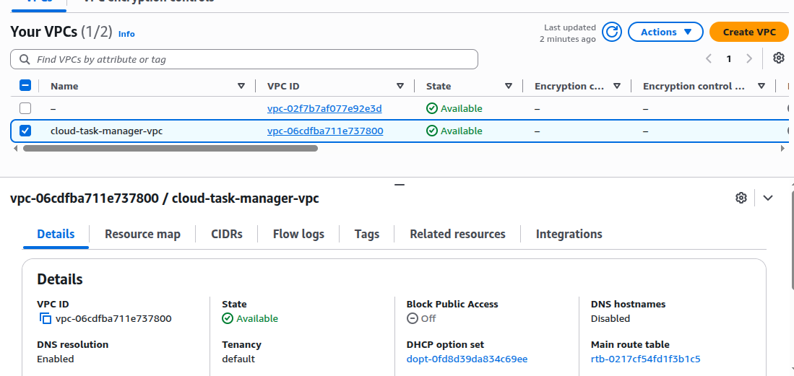
* Public and private subnets
* 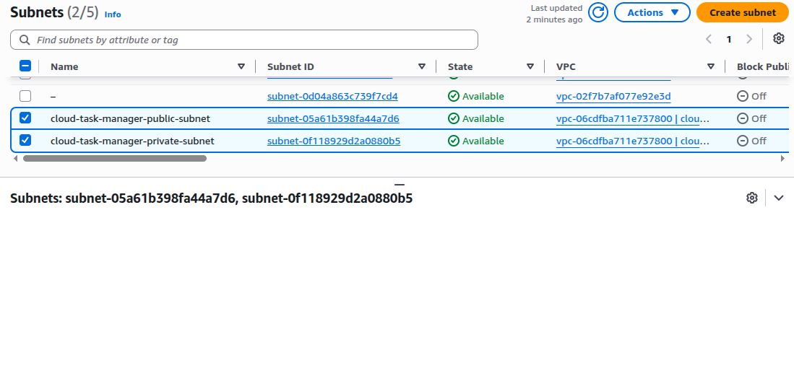
* Route tables
* 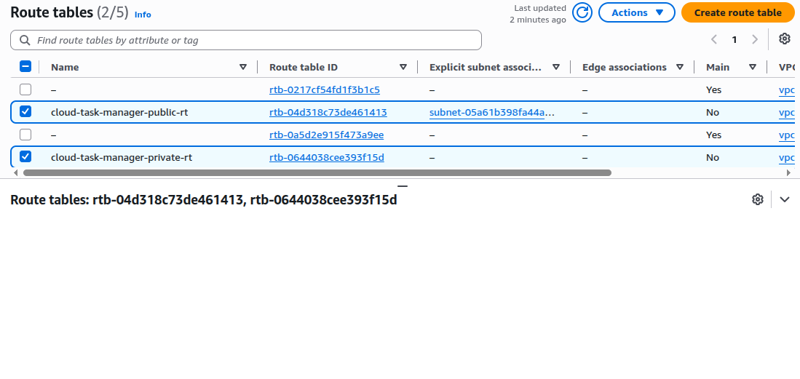
* Internet Gateway
* 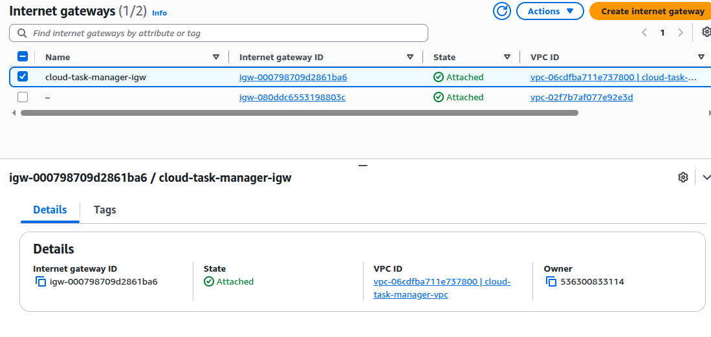
* NAT Gateway
* 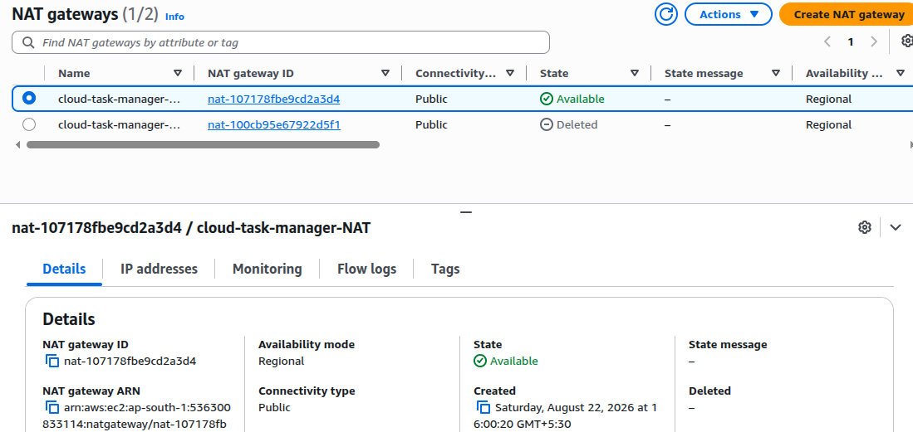
* EC2 instance
* 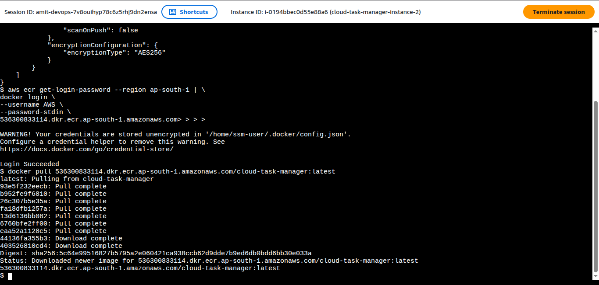
* 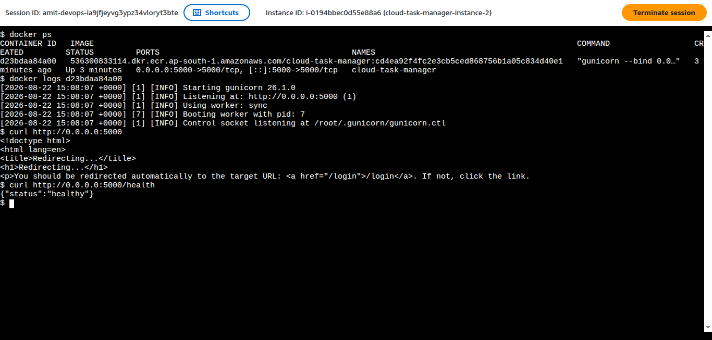
* Systems Manager managed node
* 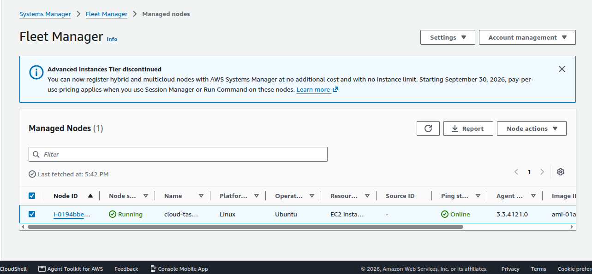
* IAM roles
* 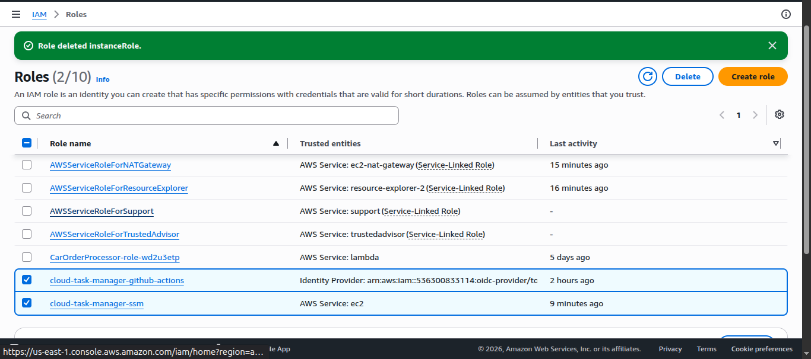
* ECR repository
* 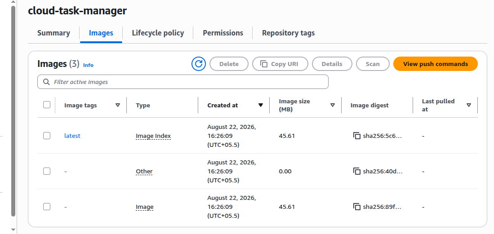
* Secrets Manager
* 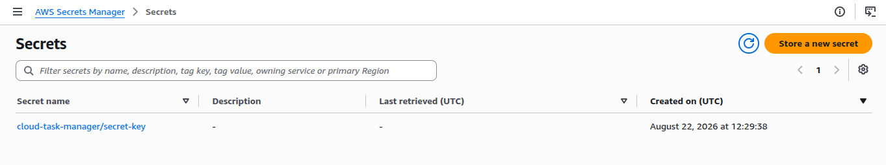
* Application Load Balancer
* 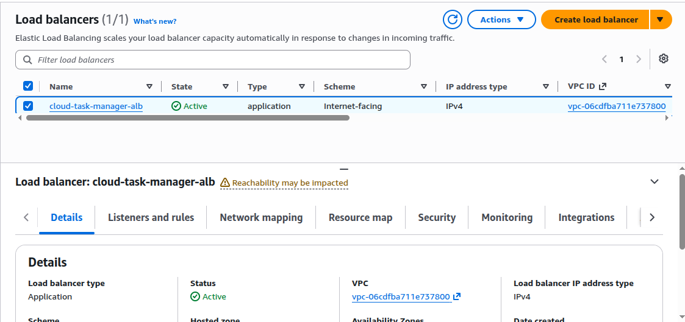
* GitHub Actions workflow
* 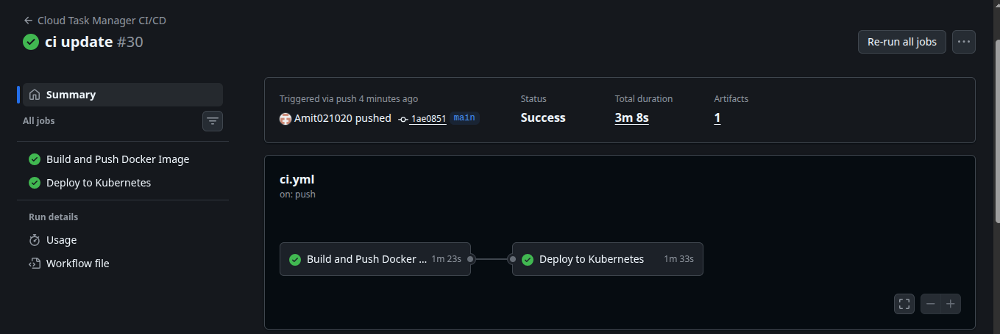
* 
* 
* 
* Successful CI/CD deployment
* 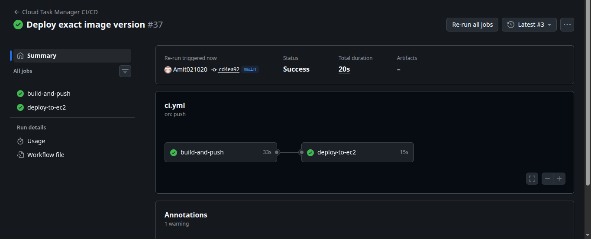
* Running application
* 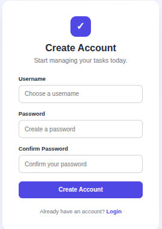
* 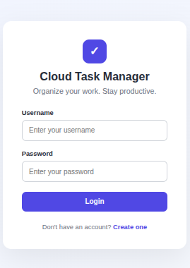
* 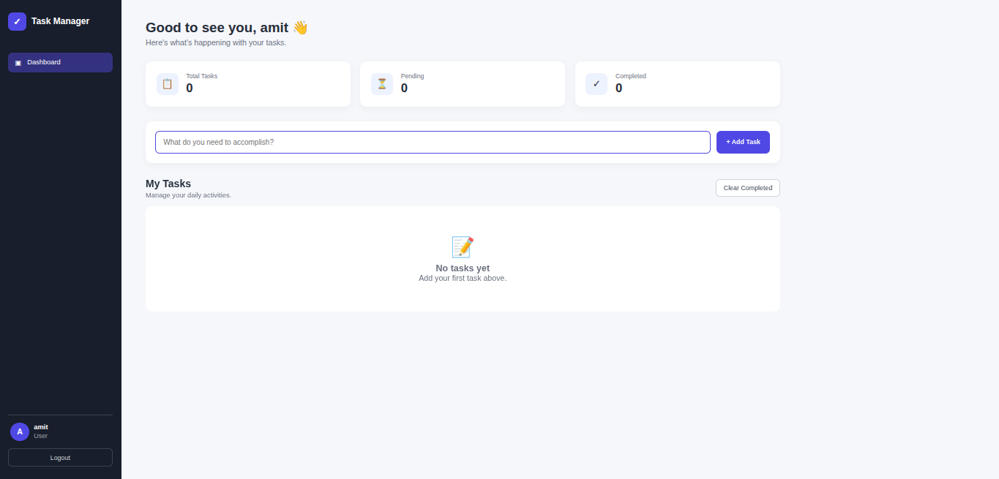
* 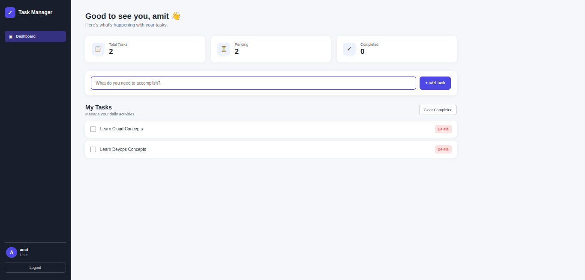
* 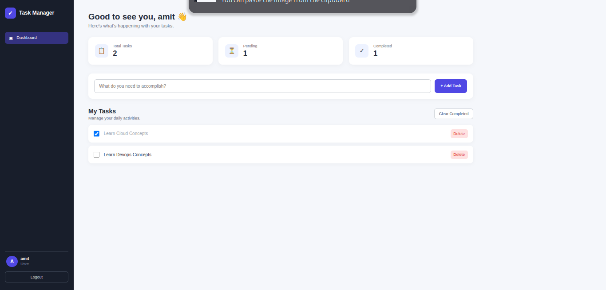

These screenshots provide evidence of the complete implementation process.

---

# 🧹 Project Shutdown

After completing the implementation and collecting the required screenshots, the AWS resources used for the project were deleted.

This was done intentionally to avoid unnecessary ongoing AWS costs.

The source code, CI/CD configuration, screenshots, and project documentation were retained for portfolio and demonstration purposes.

---

# 📚 What I Learned

This project helped develop practical understanding of how different Cloud and DevOps components work together rather than learning each technology independently.

The most important lessons included:

* How public and private subnets differ
* How route tables control traffic
* How NAT Gateway enables private-subnet outbound connectivity
* Why an internet-facing ALB belongs in public subnets
* Why application servers can remain private
* How SSM can replace direct SSH access
* How IAM roles control AWS permissions
* How GitHub OIDC provides secure CI/CD authentication
* How Docker images are built and versioned
* How ECR stores container images
* How SSM can be used for automated deployment
* How Secrets Manager prevents secrets from being hard-coded
* How ALB target health checks work
* How to troubleshoot IAM `AccessDenied` errors
* How to troubleshoot SSM connectivity problems
* How to troubleshoot Docker startup failures
* How to troubleshoot AWS networking issues
* Why versioned container images are preferable to relying on `latest`

---

# 🚀 Future Improvements

If this project were expanded into a production system, possible improvements would include:

* Infrastructure as Code using Terraform or AWS CloudFormation
* Auto Scaling Groups
* Multi-AZ EC2 deployment
* Multiple NAT Gateways for high availability
* Blue/green or rolling deployments
* Automated application testing before deployment
* Deployment rollback
* CloudWatch dashboards and alarms
* Centralized application logging
* HTTPS using AWS Certificate Manager
* Route 53 custom domain
* WAF protection
* Container orchestration using ECS or Kubernetes

These were intentionally kept outside the final implementation to maintain a focused project scope.

---

# 🏆 Skills Demonstrated

## Cloud Engineering

* AWS VPC
* AWS EC2
* Amazon ECR
* Application Load Balancer
* AWS Systems Manager
* AWS Secrets Manager
* AWS IAM
* Internet Gateway
* NAT Gateway
* Route Tables
* Security Groups

## DevOps

* CI/CD
* GitHub Actions
* Docker
* Containerization
* Automated deployments
* Image versioning
* Git
* GitHub

## Security

* IAM roles
* GitHub OIDC
* Temporary credentials
* Private EC2 deployment
* Secrets Manager
* Security group isolation
* SSM-based instance management

## Troubleshooting

* IAM AccessDenied errors
* SSM connectivity
* EC2 managed node registration
* NAT Gateway routing
* Route table blackhole routes
* Docker failures
* ECR authentication
* Flask environment variables
* ALB target health
* CI/CD deployment failures

---

# 👨‍💻 Conclusion

The Cloud Task Manager project demonstrates a complete DevOps-oriented deployment workflow for a containerized Flask application on AWS.

The application was deployed on a private EC2 instance, exposed through an Application Load Balancer, managed through AWS Systems Manager, stored in Amazon ECR, configured with AWS Secrets Manager, and automatically deployed using GitHub Actions with OIDC-based AWS authentication.

The project focused on understanding the complete lifecycle:

```text
Source Code
    ↓
Git
    ↓
GitHub
    ↓
CI/CD
    ↓
Docker
    ↓
ECR
    ↓
SSM
    ↓
Private EC2
    ↓
ALB
    ↓
Application
```

Rather than simply creating AWS resources, the project provided hands-on experience designing, deploying, securing, troubleshooting, and ultimately shutting down a complete Cloud/DevOps environment.

---

# 🔗 Project Repository

**GitHub:**
`https://github.com/Amit021020/cloud-task-manager`


---

# 📌 Project Status

**Status:** Completed

**Deployment Environment:** AWS

**Application:** Flask

**CI/CD:** GitHub Actions

**Containerization:** Docker

**Cloud Platform:** AWS

**Infrastructure:** Decommissioned after project completion to avoid unnecessary ongoing costs.
